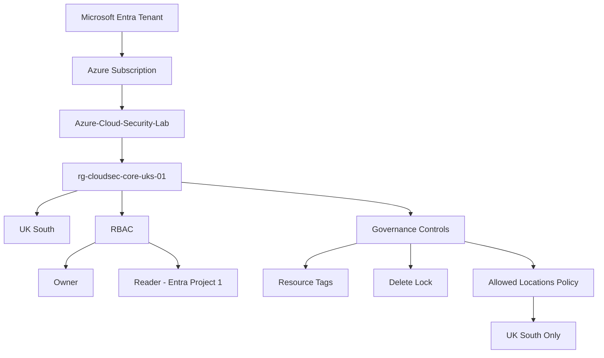

# Module 1 — Azure Foundation & Secure Architecture

## Objective

Establish a secure and governed Azure foundation for the Cloud Security Engineering environment, applying core principles including regional control, least-privilege access, resource organisation and governance enforcement.

## Environment

| Component | Configuration |
|---|---|
| Subscription | Azure-Cloud-Security-Lab |
| Core Resource Group | rg-cloudsec-core-uks-01 |
| Primary Region | UK South |
| Environment | Lab |

## Architecture

## Implementation

### 1. Azure Foundation

Created a dedicated Azure subscription and core resource group to provide the foundation for the security engineering environment.

The resource group was deployed in **UK South** and structured to host the resources introduced throughout later modules.

### 2. Role-Based Access Control

Applied Azure RBAC at resource-group scope to demonstrate least-privilege access.

**Entra Project 1** was assigned the **Reader** role, allowing visibility of resources without modification privileges.

#### Validation

The Reader account attempted to deploy a resource. Azure denied the operation because the identity did not have the required deployment permissions.

This validated that RBAC was being enforced rather than simply configured.

### 3. Resource Governance

Governance metadata was applied using resource tags:

- `Owner: CyberSecurity`
- `Environment: Lab`
- `Project: CloudSecurityPortfolio`
- `workload: core`

### 4. Resource Protection

A **Delete lock** named `lock-prevent-accidental-delete` was applied to the core resource group.

#### Validation

Deletion of the resource group was deliberately attempted and Azure blocked the operation because of the active lock.

### 5. Regional Governance

Azure Policy was configured using the **Allowed locations** definition.

**Assignment:** `CloudSec-Allowed-UK-Location`

The policy restricts resources within the core resource group to **UK South**.

#### Validation

A Storage Account deployment was deliberately configured for **East US**.

Azure Policy rejected the configuration and displayed the configured non-compliance message, confirming successful policy enforcement.

> The tagging, resource-lock and Azure Policy controls introduced here are revisited in greater depth in **Module 5 — Cloud Security Posture & Governance**.

## Security Controls Validated

| Control | Validation | Result |
|---|---|---|
| Azure RBAC | Reader attempted resource deployment | Denied |
| Resource Lock | Resource-group deletion attempted | Denied |
| Allowed Locations Policy | East US resource deployment attempted | Denied |
| Resource Tagging | Governance metadata reviewed | Confirmed |

## Skills Demonstrated

- Azure tenant and subscription hierarchy
- Resource-group architecture
- Azure regional design
- Azure Portal administration
- Role-Based Access Control (RBAC)
- Least-privilege access
- Azure resource governance
- Resource protection
- Azure Policy enforcement
- Security-control validation
- Secure cloud architecture fundamentals

## Outcome

A governed Azure foundation was established in **UK South** with access control, resource protection and regional restrictions validated through controlled negative testing.

This foundation provides the baseline for the network-security architecture implemented in **Module 2 — Azure Networking & Network Security**.
