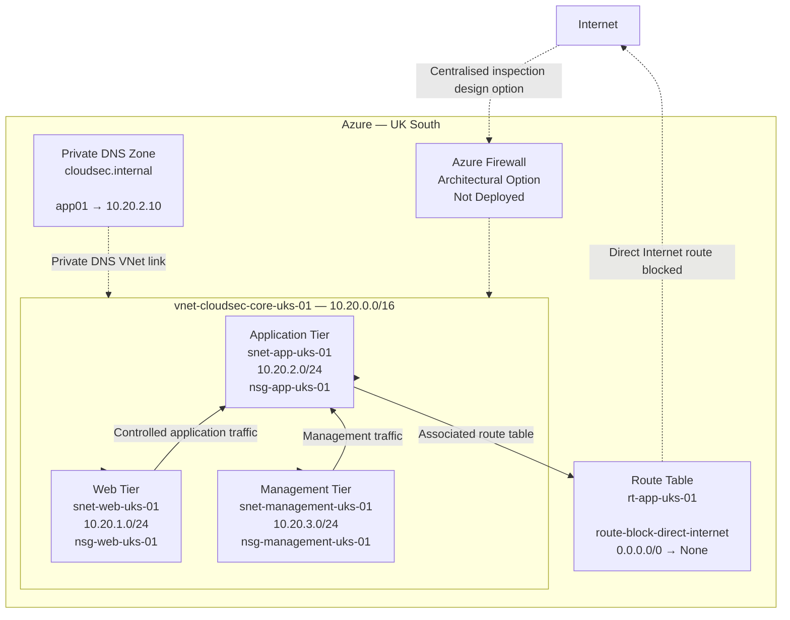
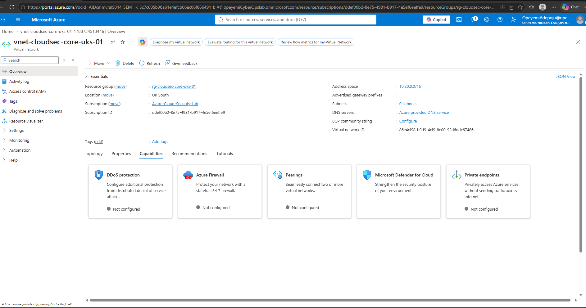
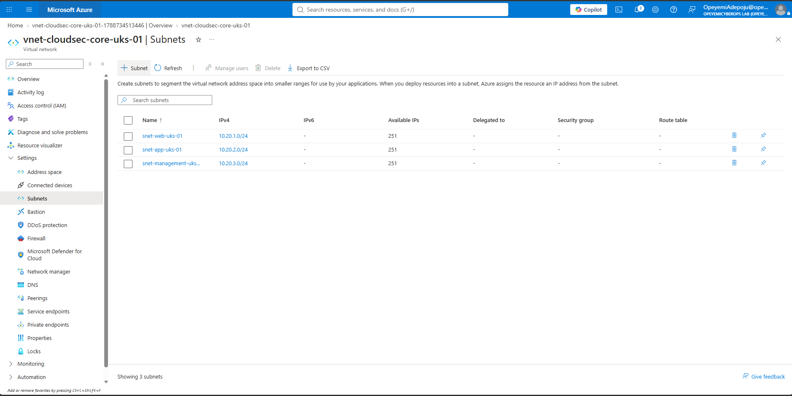
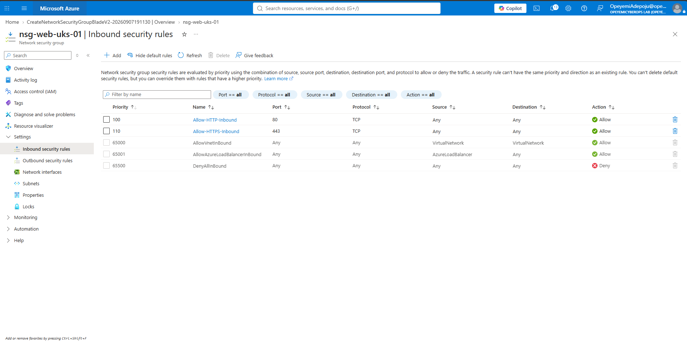
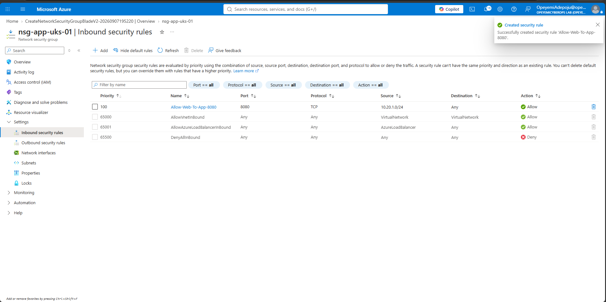
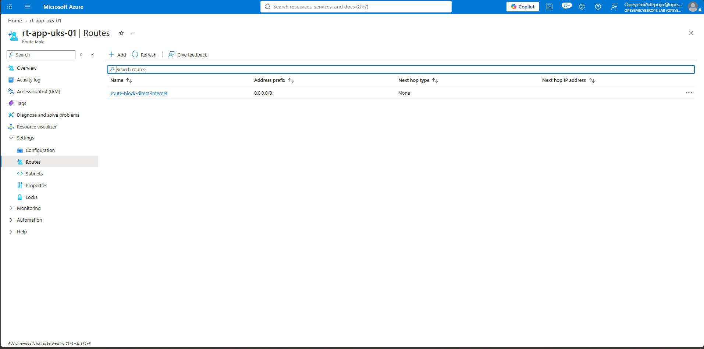
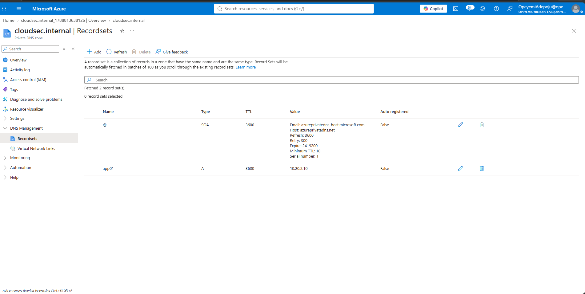
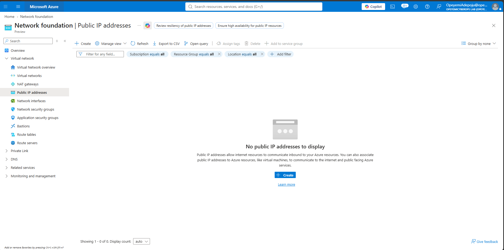
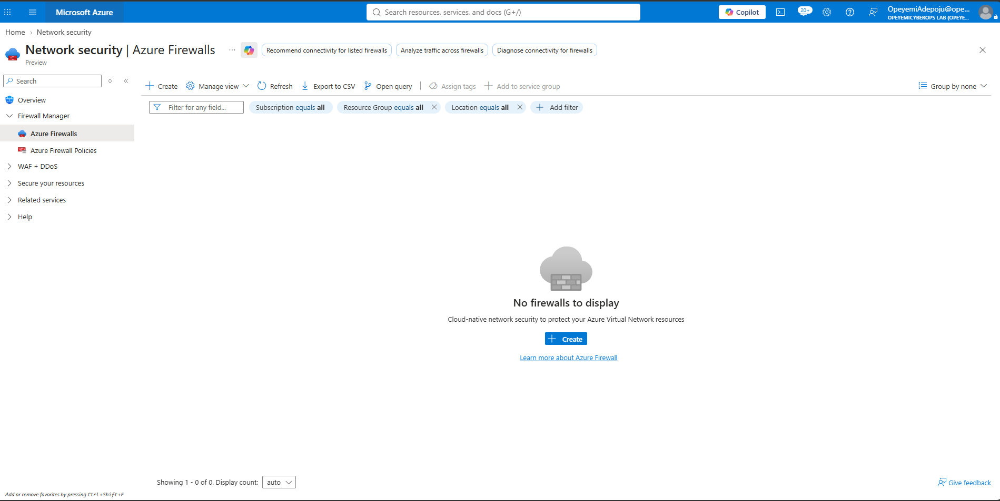

# Module 2 — Azure Networking & Network Security

## Objective

Design and implement a secure Azure network foundation using network segmentation, Network Security Groups (NSGs), user-defined routing and private DNS.

The implementation applies network security principles including workload isolation, controlled traffic flows, reduced public exposure and private name resolution.

---

## Environment

| Component | Configuration |
|---|---|
| Subscription | Azure-Cloud-Security-Lab |
| Resource Group | rg-cloudsec-core-uks-01 |
| Primary Region | UK South |
| Virtual Network | vnet-cloudsec-core-uks-01 |
| VNet Address Space | 10.20.0.0/16 |
| Environment | Lab |

---

## Network Architecture

The architecture separates web, application and management workloads into dedicated network security boundaries.

Each subnet is protected by a dedicated NSG. The application subnet is additionally associated with a custom route table that prevents direct Internet routing through a `0.0.0.0/0` route with a next-hop type of `None`.

Private DNS provides internal name resolution through a DNS zone linked directly to the virtual network.

Azure Firewall was reviewed as a centralised traffic inspection and egress-control capability but was deliberately not deployed during this stage of the lab to avoid unnecessary consumption costs.

---

## Virtual Network Design

The core virtual network was created as:

`vnet-cloudsec-core-uks-01`

with the address space:

`10.20.0.0/16`

The `/16` address space provides sufficient capacity for subnet segmentation while allowing additional network tiers to be introduced later without redesigning the VNet.

---
### Implementation Evidence

*Figure 1 — Azure Virtual Network foundation showing the deployed `vnet-cloudsec-core-uks-01` network used as the secure networking foundation for the lab environment.*

## Network Segmentation

The virtual network was segmented into three `/24` subnets.

| Subnet | Address Range | Purpose |
|---|---|---|
| snet-web-uks-01 | 10.20.1.0/24 | Web-facing application tier |
| snet-app-uks-01 | 10.20.2.0/24 | Internal application tier |
| snet-management-uks-01 | 10.20.3.0/24 | Administrative and management tier |

Separating workloads into dedicated subnets establishes security boundaries and allows network controls to be applied independently to each workload tier.

---
### Implementation Evidence

*Figure 2 — Network segmentation implemented across the web, application and management tiers using dedicated Azure subnets.*

## Network Security Groups

Dedicated Network Security Groups were implemented for the three network tiers:

- `nsg-web-uks-01`
- `nsg-app-uks-01`
- `nsg-management-uks-01`

Each NSG was associated with its corresponding subnet.

| Subnet | Network Security Group |
|---|---|
| snet-web-uks-01 | nsg-web-uks-01 |
| snet-app-uks-01 | nsg-app-uks-01 |
| snet-management-uks-01 | nsg-management-uks-01 |

Custom security rules were used to control communication between the network tiers rather than relying solely on Azure's default NSG rules.

This provides subnet-level traffic filtering and supports least-privilege network access.

### Implementation Evidence

*Figure 3 — Web-tier Network Security Group configuration demonstrating controlled inbound access through explicitly defined security rules.*

*Figure 4 — Application-tier NSG rule restricting application access to traffic originating from the authorised web tier.*

*Figure 5 — Management-tier NSG configuration demonstrating restrictive access and default-deny network security controls.*
---

## User-Defined Routing

A custom Azure route table was created:

`rt-app-uks-01`

A user-defined route was then configured:

| Route | Destination Prefix | Next Hop Type |
|---|---|---|
| route-block-direct-internet | 0.0.0.0/0 | None |

The route table was associated with:

`snet-app-uks-01`

This overrides the normal default route for the application subnet and drops traffic matching the default `0.0.0.0/0` route.

The configuration demonstrates how Azure User Defined Routes can be used to control workload traffic paths and prevent unrestricted direct Internet routing.

### Implementation Evidence

*Figure 6 — User-defined route configured for `0.0.0.0/0` with next-hop type `None`, demonstrating controlled routing designed to prevent direct Internet egress from the application subnet.*
---

## Private DNS

A Private DNS zone was deployed:

`cloudsec.internal`

The DNS zone was linked to the virtual network using:

`link-cloudsec-vnet`

The link was configured against:

`vnet-cloudsec-core-uks-01`

with:

- Auto-registration: Disabled
- Fallback to Internet: Disabled

This allows resources connected to the VNet to use the private DNS namespace without exposing the zone publicly.

---

## Private DNS Record

A private IPv4 A record was configured inside `cloudsec.internal`.

| Record | Type | IP Address |
|---|---|---|
| app01 | A | 10.20.2.10 |

This produces the internal DNS name:

`app01.cloudsec.internal`

The record demonstrates how internal workloads can be addressed through private DNS rather than relying directly on IP addresses or public DNS.

### Implementation Evidence

*Figure 7 — Azure Private DNS A record mapping `app01.cloudsec.internal` to the private IP address `10.20.2.10`.*
---

## Public Exposure Review

The Azure environment was reviewed for Public IP Address resources.

No Public IP Address resources were deployed as part of the Module 2 network foundation.

Avoiding unnecessary public IP addresses reduces the externally exposed attack surface and supports a private-by-design Azure architecture.

### Implementation Evidence

*Figure 8 — Azure Public IP inventory confirming that no Public IP Address resources were deployed as part of the Module 2 network foundation.*
---

## Azure Firewall Design Review

Azure Firewall was reviewed as part of the network security architecture.

A production-scale architecture could introduce Azure Firewall to provide capabilities such as:

- Centralised network traffic inspection
- Controlled Internet egress
- Network and application filtering
- Threat intelligence-based filtering
- Centralised logging
- Traffic forwarding through a security inspection point

Azure Firewall was **not deployed during this module**.

The decision avoids unnecessary consumption costs while retaining the service as a future architectural enhancement.

The implemented environment instead demonstrates the underlying network security controls required before introducing centralised firewall inspection.

### Design Evidence

*Figure 9 — Azure Firewall review showing that no firewall instance was deployed during this module. Firewall capabilities were assessed architecturally while avoiding unnecessary lab cost.*
---

## Security Design Principles

The Module 2 implementation applies the following security principles:

**Network segmentation**

Web, application and management workloads are separated into dedicated subnets.

**Least-privilege network access**

NSGs provide subnet-level controls for permitted traffic flows.

**Controlled routing**

User-defined routing prevents the application subnet from using an unrestricted default Internet route.

**Private name resolution**

Azure Private DNS provides internal DNS resolution within the virtual network.

**Reduced public exposure**

No Public IP Address resources were deployed as part of the network foundation.

**Cost-aware security architecture**

Azure Firewall was evaluated architecturally without deploying a consumption-based service that was unnecessary for the current lab objectives.

---

## Security Outcomes

Module 2 demonstrates practical implementation and understanding of:

- Azure Virtual Networks
- CIDR address planning
- Subnet design
- Network segmentation
- Network Security Groups
- NSG-to-subnet association
- Traffic-flow control
- Azure routing concepts
- User Defined Routes
- Default route manipulation
- Public versus private IP architecture
- Azure Private DNS
- Private DNS VNet linking
- Internal DNS records
- Azure Firewall architecture concepts
- Reduced Internet exposure
- Cost-aware cloud security engineering

---

## Conclusion

Module 2 established the network security foundation for the Azure Cloud Security Engineering environment.

The architecture now provides segmented web, application and management network tiers, dedicated NSG protection, controlled application-subnet routing and private DNS resolution.

These controls provide the network foundation required for the secure Azure workloads and Zero Trust controls implemented in subsequent modules.
