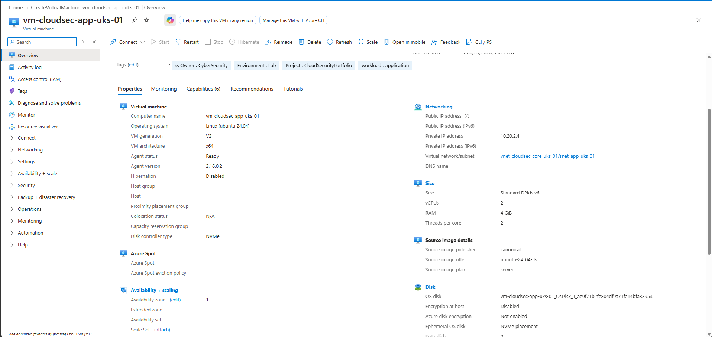
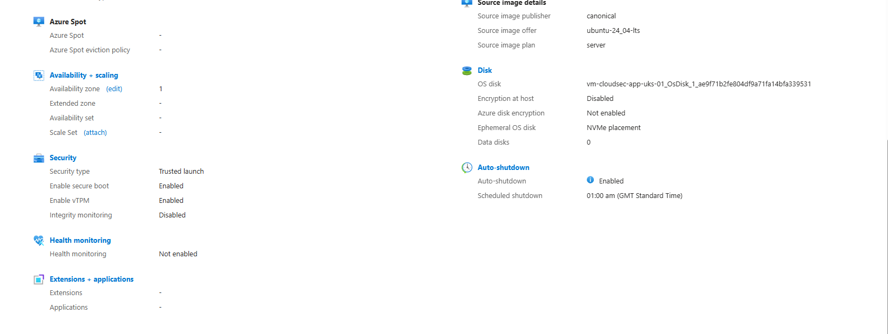
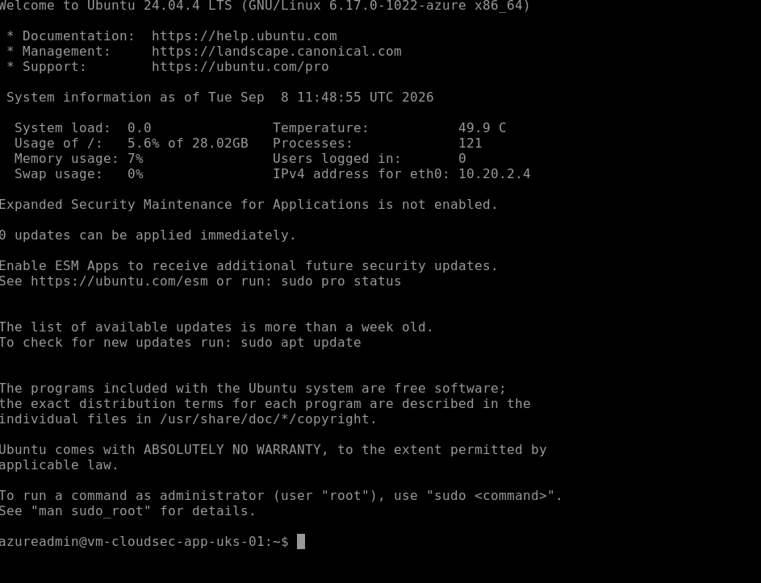
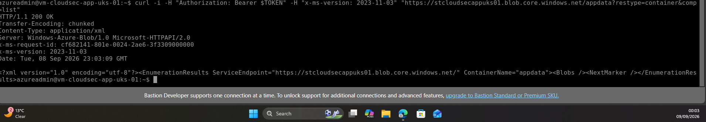

03-secure-azure-workloads/README.md
# Module 3 — Secure Azure Workloads

## Objective

Design and implement a secure Azure application workload using hardened virtual machines, secure storage, managed identities, Azure RBAC, Key Vault, secrets management and encryption.

The implementation demonstrates how Azure workloads can securely access dependent services without storing long-lived credentials within the workload.

---

## Environment

| Component | Configuration |
|---|---|
| Subscription | Azure-Cloud-Security-Lab |
| Resource Group | rg-cloudsec-core-uks-01 |
| Primary Region | UK South |
| Virtual Network | vnet-cloudsec-core-uks-01 |
| Application Subnet | snet-app-uks-01 |
| Virtual Machine | vm-cloudsec-app-uks-01 |
| Storage Account | stcloudsecappuks01 |
| Key Vault | kv-cloudsec-app-uks-01 |
| Environment | Lab |

---

## 1. Secure Virtual Machine Deployment

A Linux virtual machine named `vm-cloudsec-app-uks-01` was deployed into the application subnet.

Security controls implemented include:

- No public IP address
- Trusted Launch
- Secure Boot
- Virtual TPM (vTPM)
- Subnet-level Network Security Group protection
- Azure Bastion administrative access
- System-assigned managed identity

The VM uses private IP address `10.20.2.4` and does not expose SSH directly to the Internet.

### Evidence



*Deployment of `vm-cloudsec-app-uks-01` as the secured application workload for the Cloud Security lab.*



*Trusted Launch security configuration for `vm-cloudsec-app-uks-01`, including Secure Boot and vTPM protection.*



*Successful secure SSH administrative access to `vm-cloudsec-app-uks-01` through Azure Bastion without exposing the VM through a public IP.*
---


## 2. Network-Isolated Workload

The application subnet is associated with `rt-app-uks-01`.

The route:

`0.0.0.0/0 → None`

prevents direct Internet-bound traffic from the application subnet.

Connectivity testing from the VM confirmed that direct outbound Internet access was blocked while administrative access remained available through Azure Bastion.

---

## 3. Secure Azure Storage

The storage account `stcloudsecappuks01` was configured with security controls including:

- Anonymous blob access disabled
- Secure transfer required
- Minimum TLS version 1.2
- Public network access restricted to selected networks
- Soft delete enabled
- Cross-tenant replication disabled

Storage network access was restricted to the required application subnet.

---

## 4. Managed Identity and Least-Privilege RBAC

A system-assigned managed identity was enabled on `vm-cloudsec-app-uks-01`.

The VM identity was granted:

`Storage Blob Data Reader`

on the storage account.

This provides read-only blob access without storing storage account keys, passwords or other long-lived Azure credentials on the VM.

### Validation

The VM requested an OAuth token from the Azure Instance Metadata Service and authenticated to Azure Blob Storage using its managed identity.

The storage request returned:

`HTTP/1.1 200 OK`

This validated both the managed identity and its least-privilege RBAC authorization.

### Evidence



*Successful HTTP 200 response from Azure Blob Storage using the system-assigned managed identity of `vm-cloudsec-app-uks-01`, validating credential-free authentication and least-privilege RBAC access.*
---

## 5. Azure Key Vault and Secret Management

Azure Key Vault `kv-cloudsec-app-uks-01` was deployed to centralize application secret management.

Security controls included:

- Azure RBAC authorization
- Soft delete
- Purge protection
- Restricted network access
- Selected virtual network access
- Controlled administrative access

A test application secret named `app-api-key` was created in the vault.

The VM's managed identity was authorized to access the required secret, allowing the workload to authenticate without storing Azure credentials locally.

---

## 6. Encryption at Rest

The operating system disk attached to `vm-cloudsec-app-uks-01` was verified as:

`SSE with PMK`

This confirms that the VM operating system disk is encrypted at rest using Azure Storage Server-Side Encryption with a Platform-Managed Key.

---

## Security Architecture

```text
vm-cloudsec-app-uks-01
        |
        | System-Assigned Managed Identity
        v
 Microsoft Entra ID
        |
        | Azure RBAC
        |
        +--------------------------+
        |                          |
        v                          v
 Azure Storage                Azure Key Vault
 Blob Data Reader             Secret Access
