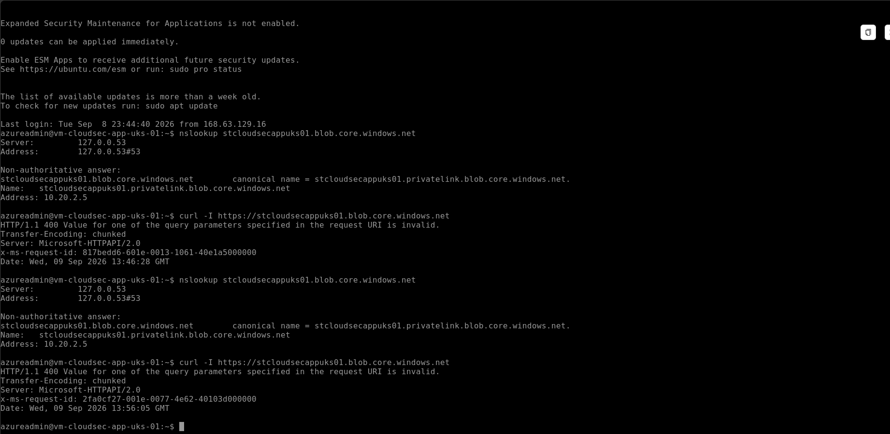
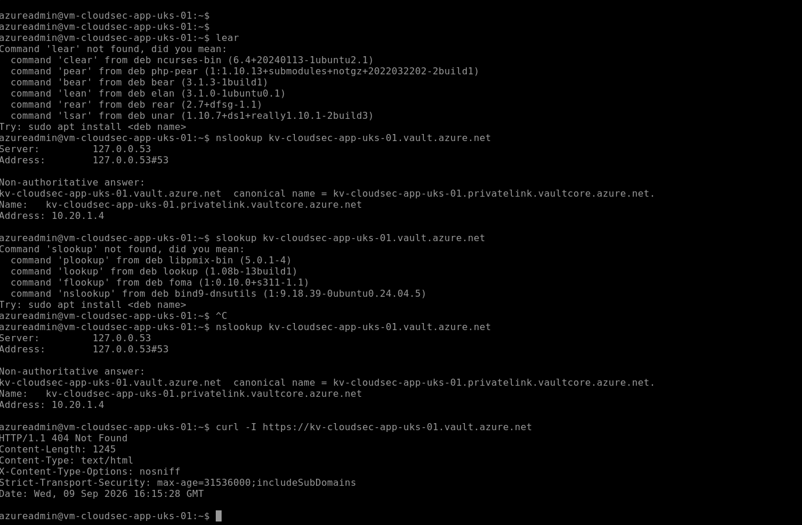
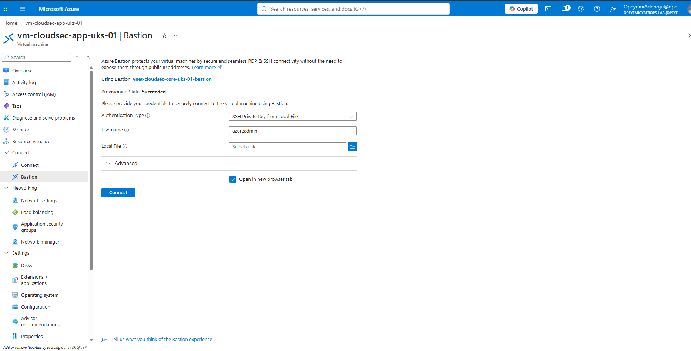
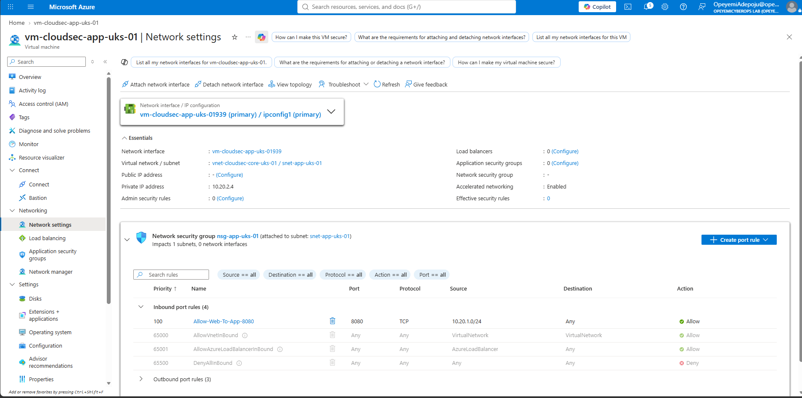

# Module 4 — Private Access & Zero-Trust Architecture

## Objective

Design and implement private connectivity for Azure workloads using Private Endpoints, Private DNS, public-access restrictions, network segmentation and secure administrative access.

This module demonstrates how Azure workloads can access platform services privately without exposing those services or the application virtual machine directly to the public internet.

## Environment

| Resource | Configuration |
|---|---|
| Subscription | Azure-Cloud-Security-Lab |
| Resource Group | rg-cloudsec-core-uks-01 |
| Virtual Network | vnet-cloudsec-core-uks-01 |
| Application Subnet | snet-app-uks-01 |
| Virtual Machine | vm-cloudsec-app-uks-01 |
| VM Private IP | 10.20.2.4 |
| Storage Account | stcloudsecappuks01 |
| Storage Private Endpoint IP | 10.20.2.5 |
| Key Vault | kv-cloudsec-app-uks-01 |
| Key Vault Private Endpoint IP | 10.20.1.4 |

## 1. Azure Storage Private Endpoint

A Private Endpoint was deployed for the Blob service of `stcloudsecappuks01`.

Private DNS integration was configured using:

`privatelink.blob.core.windows.net`

DNS resolution from the application VM confirmed that the Storage Account resolves to private IP `10.20.2.5`.

The previous service-endpoint-based access was removed and public network access to the Storage Account was disabled.

### Evidence



*Validation from the application VM showing Azure Blob Storage resolving through Private Link to private IP `10.20.2.5` and remaining reachable after public network access was disabled.*

## 2. Azure Key Vault Private Endpoint

A Private Endpoint was deployed for `kv-cloudsec-app-uks-01`.

Private DNS integration was configured using:

`privatelink.vaultcore.azure.net`

DNS resolution from the application VM confirmed that the Key Vault resolves to private IP `10.20.1.4`.

Public network access to the Key Vault was disabled after private connectivity was validated.

### Evidence



*Validation from the application VM showing Azure Key Vault resolving through Private Link to private IP `10.20.1.4` and remaining reachable after public network access was disabled.*

## 3. Private DNS

Both Private DNS zones were linked to:

`vnet-cloudsec-core-uks-01`

The following private name resolution was validated:

- `stcloudsecappuks01.blob.core.windows.net` → `10.20.2.5`
- `kv-cloudsec-app-uks-01.vault.azure.net` → `10.20.1.4`

This allows workloads to use standard Azure service hostnames while traffic is directed to private endpoints within the virtual network.

## 4. Service Endpoints vs Private Endpoints

Service Endpoints provide controlled access from selected Azure virtual networks to Azure services while the service continues to use its public endpoint.

Private Endpoints instead assign the service a private IP address reachable from the virtual network.

For this architecture, Private Endpoints were used together with disabled public network access to remove the public network path to Storage and Key Vault.

## 5. Secure Administrative Access

The application VM has no public IP address.

Administrative SSH access is provided through Azure Bastion:

`vnet-cloudsec-core-uks-01-bastion`

This allows administrators to securely access the workload without exposing SSH directly to the internet.

### Evidence



*Azure Bastion configuration providing secure SSH administrative access to `vm-cloudsec-app-uks-01` without assigning a public IP address to the workload.*

## 6. Network Segmentation

The application VM is deployed in:

`snet-app-uks-01`

The subnet is protected by:

`nsg-app-uks-01`

Application traffic on TCP port 8080 is permitted from the web subnet `10.20.1.0/24`, while Azure NSG controls provide additional network enforcement.

## Security Architecture


```text
                        Administrator
                             |
                             v
                       Azure Bastion
                             |
                             v
                vm-cloudsec-app-uks-01
                       10.20.2.4
                             |
          ---------------------------------
          |                               |
          v                               v
 Storage Private Endpoint        Key Vault Private Endpoint
       10.20.2.5                        10.20.1.4
          |                               |
          v                               v
  stcloudsecappuks01          kv-cloudsec-app-uks-01
 Public Access: Disabled      Public Access: Disabled
          |                               |
          v                               v
privatelink.blob.core.       privatelink.vaultcore.
     windows.net                  azure.net
          \                               /
           \                             /
            -------- Private DNS --------
                      |
                      v
           vnet-cloudsec-core-uks-01

### Evidence



*Network configuration for `vm-cloudsec-app-uks-01`, demonstrating private addressing, subnet-level NSG protection and controlled application traffic within the segmented Azure virtual network.*


## Security Outcomes

- Azure Storage is accessed through a Private Endpoint.
- Azure Key Vault is accessed through a Private Endpoint.
- Public network access is disabled for Storage and Key Vault.
- Private DNS provides private service name resolution.
- The application VM has no public IP address.
- Administrative access is provided through Azure Bastion.
- Network segmentation is enforced using subnets and NSGs.
- Managed Identity and Azure RBAC remain responsible for workload authentication and authorization.
