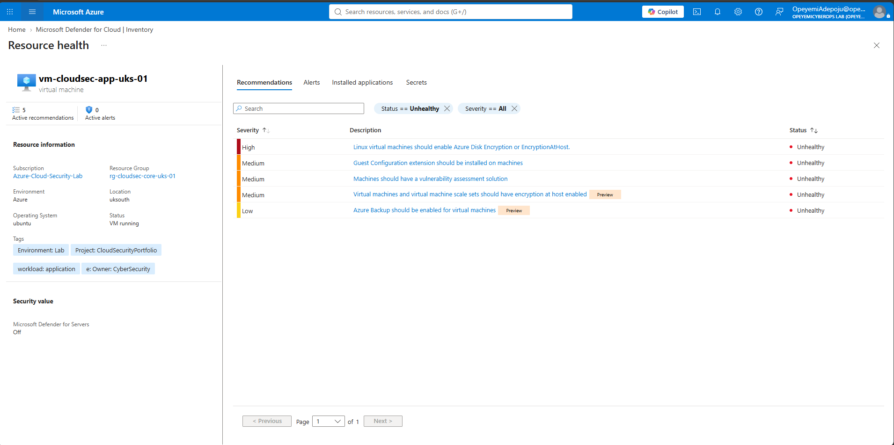
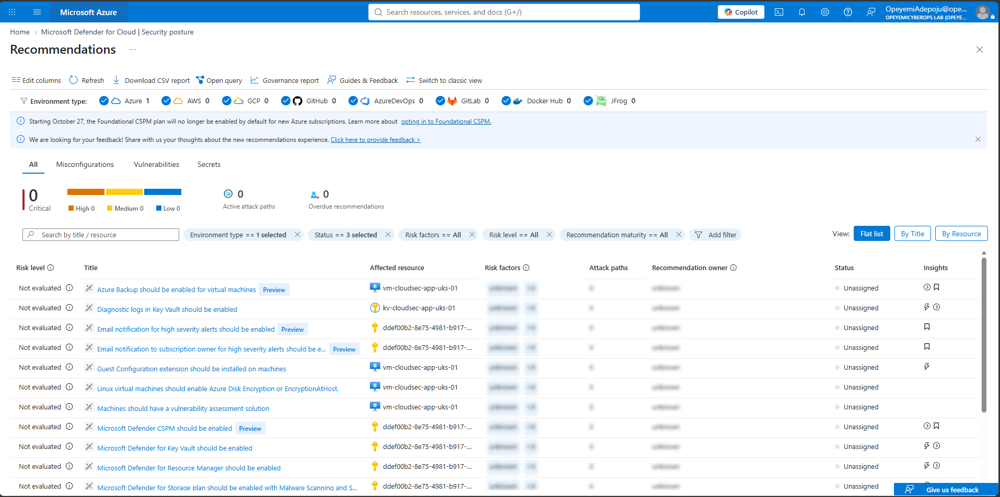
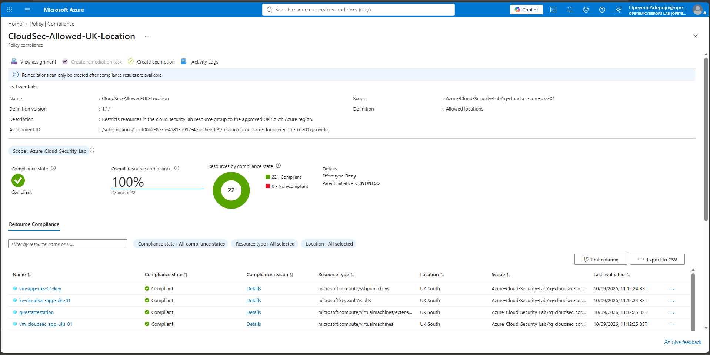
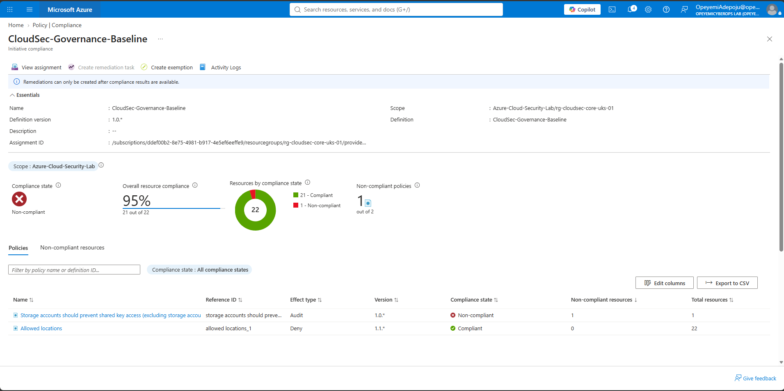
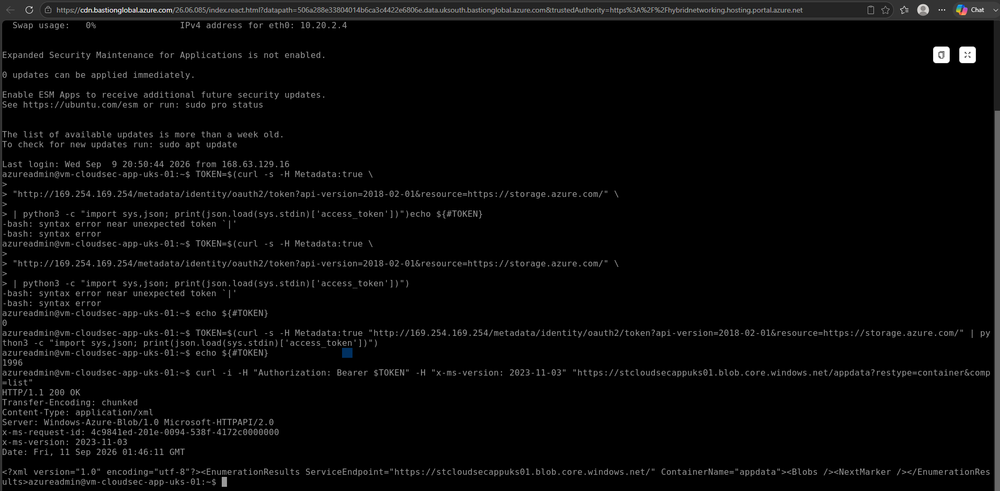
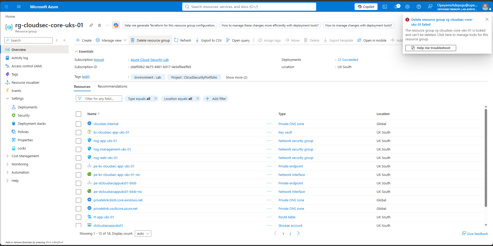

# Module 5 — Cloud Security Posture & Governance

## Objective

This module focused on assessing and improving Azure cloud security posture using Microsoft Defender for Cloud and Azure Policy.

The implementation covered security posture assessment, Secure Score analysis, policy compliance, custom policy initiatives, governance controls, remediation of an identified storage security weakness, and validation that remediation did not disrupt legitimate workload access.

---

## 1. Microsoft Defender for Cloud & Security Posture

Microsoft Defender for Cloud was used to assess the security posture of the Azure Cloud Security Lab.

The Defender for Cloud inventory identified the Azure resources within the environment and highlighted resources requiring security review.

The assessment included:

- Virtual machines
- Storage accounts
- Azure Key Vault
- Virtual networks
- Subnets
- Subscription-level security posture

The initial assessment showed:

- 8 assessed Azure resources
- 4 resources with security recommendations
- 0 attack paths
- 0 security alerts
- Secure Score of 55%

Paid Defender workload protection plans were not enabled as part of this lab.

### Evidence



*Microsoft Defender for Cloud inventory showing security posture assessment across the Azure Cloud Security Lab, including eight discovered Azure resources and four resources identified with security recommendations requiring review.*

---

## 2. Secure Score & Security Recommendations

Microsoft Defender for Cloud Secure Score was reviewed to understand the overall security posture of the environment.

The lab subscription recorded:

- Secure Score: 55%
- 4 unhealthy resources
- 16 security recommendations
- 0 identified attack paths

Security recommendations included areas such as:

- Virtual machine encryption
- Vulnerability assessment
- Guest Configuration
- Azure Backup
- Diagnostic logging
- Defender workload protection

Secure Score was treated as a security posture and prioritisation mechanism rather than as a direct measurement of breach probability.

### Evidence



*Microsoft Defender for Cloud Security Posture dashboard showing a 55% Secure Score for the Azure-Cloud-Security-Lab subscription, with four unhealthy resources and sixteen recommendations requiring security review.*

---

## 3. Azure Policy Compliance Assessment

Azure Policy was used to assess governance compliance across the lab environment.

The existing custom policy assignment:

`CloudSec-Allowed-UK-Location`

restricts resources within:

`rg-cloudsec-core-uks-01`

to the approved Azure region:

`UK South`

The policy uses the **Deny** effect.

Compliance validation showed:

- 100% compliance
- 22 of 22 evaluated resources compliant
- 0 non-compliant resources

This demonstrated that the regional governance control was successfully enforcing the approved deployment location.

### Evidence



*Azure Policy compliance assessment for CloudSec-Allowed-UK-Location, demonstrating 100% compliance across 22 evaluated resources within the cloud security lab resource group, with the Deny effect enforcing deployment exclusively to the approved UK South region.*

---

## 4. Custom Governance Policy Initiative

A custom Azure Policy initiative was created to demonstrate centralised management of multiple governance controls.

### Initiative

`CloudSec-Governance-Baseline`

The initiative grouped two Azure Policy definitions:

1. Allowed locations
2. Storage accounts should prevent shared key access

An initiative parameter named:

`allowedLocations`

was created and mapped to the **Allowed locations** policy parameter.

The default approved location was configured as:

`UK South`

The initiative was assigned to:

`Azure-Cloud-Security-Lab/rg-cloudsec-core-uks-01`

Policy enforcement remained enabled.

Policy-specific non-compliance messages were also configured to provide meaningful guidance when resources violate the governance baseline.

---

## 5. Initiative Compliance Assessment

Following assignment, Azure Policy evaluated the resources within the target scope.

The initiative initially reported:

- Overall resource compliance: 95%
- 21 of 22 resources compliant
- 1 non-compliant resource
- 1 of 2 policies non-compliant

The **Allowed locations** policy was fully compliant.

The **Storage accounts should prevent shared key access** policy identified one non-compliant storage account:

`stcloudsecappuks01`

### Evidence



*Azure Policy compliance assessment for the custom CloudSec-Governance-Baseline initiative, demonstrating centralised evaluation of multiple governance controls. The initiative achieved 95% resource compliance, with the Allowed Locations Deny policy fully compliant and the Storage Shared Key Audit policy identifying one non-compliant storage resource.*

---

## 6. Storage Shared Key Security Finding

The Azure Policy finding was investigated rather than immediately changing the resource.

The storage account configuration confirmed:

`Allow storage account key access = Enabled`

This meant that Shared Key authentication remained available on the storage account.

The policy used the **Audit** effect, meaning Azure Policy detected the insecure configuration but did not automatically modify the storage account.

Because the application VM had already been designed to use **Managed Identity and Azure RBAC**, Shared Key authentication was not required for the workload.

The storage account was therefore hardened by changing:

`Allow storage account key access = Disabled`

This removed Shared Key authentication capability from the storage account.

---

## 7. Post-Remediation Workload Validation

Security remediation was followed by functional validation to ensure the change did not break legitimate application access.

The application VM:

`vm-cloudsec-app-uks-01`

used its system-assigned Managed Identity to request an Azure Storage access token from the Azure Instance Metadata Service.

A token was successfully issued.

The VM then accessed:

`stcloudsecappuks01`

and the Blob container:

`appdata`

using the Entra-issued bearer token.

Azure Blob Storage returned:

`HTTP/1.1 200 OK`

This demonstrated successful workload access after Shared Key authentication had been disabled.

The resulting authentication path was:

`VM → Managed Identity → Microsoft Entra ID Token → Azure RBAC → Private Endpoint → Azure Blob Storage`

### Evidence



*Validation of secure Azure Storage authentication after disabling Shared Key access. The application VM successfully obtained an Entra access token through its system-assigned Managed Identity and accessed the appdata Blob container with HTTP 200 OK, confirming continued RBAC-based access without storage account keys.*

---

## 8. Governance Controls Validation

Existing Azure governance controls were reviewed and validated rather than unnecessarily recreated.

### Resource Tags

The core resource group maintained the following governance metadata:

| Tag | Value |
|---|---|
| Owner | CyberSecurity |
| Environment | Lab |
| Project | CloudSecurityPortfolio |
| workload | core |

These tags provide consistent metadata for ownership, environment identification, workload classification and governance.

### Resource Lock

The resource group was protected by the existing Delete lock:

`lock-prevent-accidental-delete`

To validate enforcement, a controlled deletion attempt was initiated against:

`rg-cloudsec-core-uks-01`

Azure Resource Manager rejected the deletion because the resource group was locked.

This demonstrated that the governance control actively protects the environment against accidental deletion.

### Evidence



*Enforcement validation of the Azure Resource Manager Delete lock protecting rg-cloudsec-core-uks-01. An attempted resource group deletion was blocked because the resource group is locked, demonstrating protection against accidental or unauthorized deletion.*

---

## 9. Governance Architecture

The security posture and governance implementation in this module can be represented as:

```text
                    Azure-Cloud-Security-Lab
                              |
                              v
                 rg-cloudsec-core-uks-01
                              |
          +-------------------+-------------------+
          |                   |                   |
          v                   v                   v
   Defender for Cloud     Azure Policy      Governance Controls
          |                   |                   |
          v                   v                   v
   Security Posture     Custom Initiative     Resource Tags
   Secure Score         CloudSec-Governance   Delete Lock
   Recommendations      Baseline
                              |
                    +---------+---------+
                    |                   |
                    v                   v
              Allowed Locations    Storage Shared Key
                   Deny                 Audit
                    |                   |
                    v                   v
               UK South          Finding Detected
                                      |
                                      v
                             Shared Key Disabled
                                      |
                                      v
                         Managed Identity Validation
                                      |
                                      v
                               HTTP 200 OK
```
---

## 10. Key Security Outcomes

This module demonstrated the ability to:

- Assess Azure security posture using Microsoft Defender for Cloud.
- Interpret Secure Score and security recommendations.
- Analyse Azure Policy compliance.
- Validate policy enforcement using the Deny effect.
- Create and assign a custom Azure Policy initiative.
- Configure initiative-level parameters.
- Identify policy-driven security weaknesses.
- Understand the difference between Audit, Deny and remediation-capable policy effects.
- Remediate an identified storage authentication weakness.
- Replace reliance on Shared Key authentication with Managed Identity and Azure RBAC.
- Validate workload functionality after security hardening.
- Validate governance tags and resource locks.
- Demonstrate resource lock enforcement through a controlled deletion attempt.

---

## Module Status

**Module 5 — Cloud Security Posture & Governance: COMPLETE**

The environment now demonstrates practical cloud security posture management, policy-driven governance, security remediation, identity-based workload authentication, and preventative Azure governance controls.
