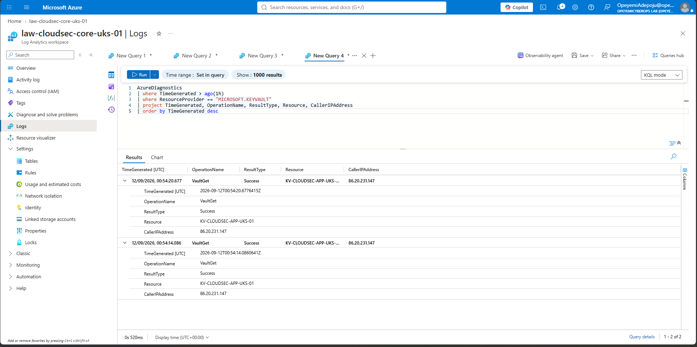
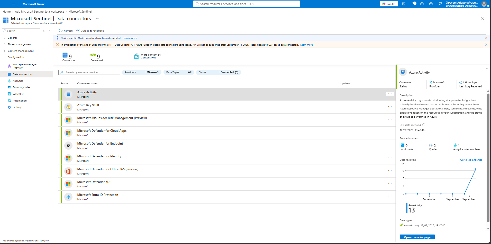
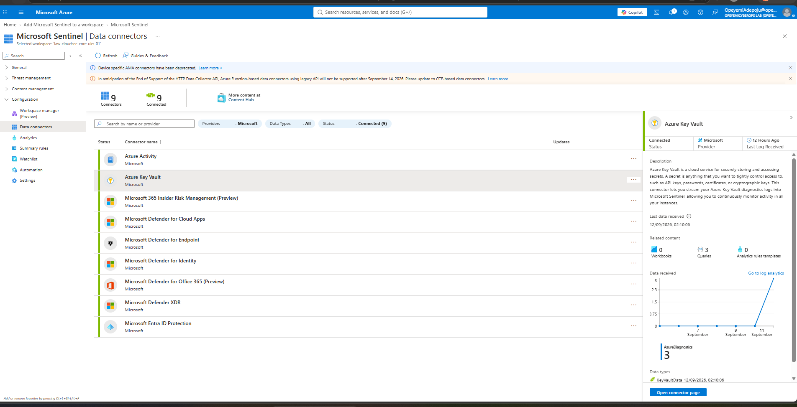

# Module 8 - Azure Monitoring & Microsoft Sentinel

## Overview

This module implements centralized Azure monitoring, security telemetry collection, and Microsoft Sentinel SIEM integration.

The objective was to establish an end-to-end monitoring architecture capable of collecting Azure control-plane and resource-level security telemetry, centralizing it within Log Analytics, and making the data available to Microsoft Sentinel for security monitoring and analysis.

The implemented monitoring flow is:

**Azure Resources → Diagnostic Settings → Log Analytics Workspace → Microsoft Sentinel**

---

## 1. Azure Monitoring Architecture & Log Analytics Workspace

A dedicated Log Analytics workspace was deployed as the central collection and analysis platform for Azure monitoring and security telemetry.

### Configuration

- **Workspace:** `law-cloudsec-core-uks-01`
- **Resource Group:** `rg-cloudsec-core-uks-01`
- **Region:** UK South
- **Subscription:** `Azure-Cloud-Security-Lab`

The workspace provides the centralized logging foundation for Azure Monitor and Microsoft Sentinel.

---

## 2. Azure Activity Log Collection

Subscription-level Azure Activity Logs were configured for export to the Log Analytics workspace.

### Diagnostic Setting

`ds-activitylog-to-law`

The following Activity Log categories were enabled:

- Administrative
- Security
- ServiceHealth
- Alert
- Recommendation
- Policy
- Autoscale
- ResourceHealth

This provides centralized visibility into Azure control-plane operations including administrative changes, resource modifications, policy activity, security events and service health events.

---

## 3. Resource Diagnostic Settings

Resource-level diagnostic settings were configured to capture security-relevant data-plane telemetry.

### Azure Key Vault

Resource:

`kv-cloudsec-app-uks-01`

Diagnostic setting:

`ds-keyvault-to-law`

Key Vault audit telemetry and metrics were configured for collection in:

`law-cloudsec-core-uks-01`

This provides visibility into operations performed against the Key Vault.

### Azure Storage

Resource:

`stcloudsecappuks01`

Blob service diagnostic logging was configured for security-relevant Storage operations including:

- StorageRead
- StorageWrite
- StorageDelete
- Transaction metrics

Telemetry was directed to the central Log Analytics workspace.

---

## 4. Log Ingestion & Data Validation

End-to-end log ingestion was validated by generating real resource activity and querying the resulting telemetry.

### Key Vault Audit Log Validation

The secure application VM accessed Azure Key Vault using its system-assigned Managed Identity.

The operation successfully generated Key Vault audit telemetry within Log Analytics.

Successful `VaultGet` operations were recorded for:

`KV-CLOUDSEC-APP-UKS-01`

This validated the telemetry path:

**Key Vault → Diagnostic Settings → Log Analytics → AzureDiagnostics**



**Evidence:** Successful `VaultGet` operations recorded in `AzureDiagnostics`, demonstrating end-to-end Key Vault audit telemetry ingestion.

---

### Storage Blob Log Validation

Storage Blob access was generated to validate Storage diagnostic telemetry ingestion.

The test confirmed that Storage operations could be collected centrally and queried through the monitoring platform.


**Evidence:** Storage Blob diagnostic telemetry successfully ingested into the central Log Analytics workspace.

---

## 5. Microsoft Sentinel Enablement & Architecture

Microsoft Sentinel was enabled on the existing Log Analytics workspace:

`law-cloudsec-core-uks-01`

This extended the monitoring architecture with cloud-native SIEM capabilities for:

- Security monitoring
- Threat detection
- Investigation
- Incident management
- Threat hunting
- Security automation

The resulting architecture is:

**Azure Resources → Diagnostic Settings → Log Analytics Workspace → Microsoft Sentinel**

Microsoft Sentinel can now consume and analyse security telemetry collected by the workspace.

---

## 6. Sentinel Data Connectors & Security Telemetry

Microsoft Sentinel data connectivity was validated using the telemetry already being collected within the environment.

### Azure Activity

The Azure Activity connector showed active telemetry ingestion.

Validated state:

- **Status:** Connected
- Azure Activity telemetry received
- `AzureActivity` data available
- 13 Azure Activity records displayed during validation



**Evidence:** Microsoft Sentinel Azure Activity connector showing connected status and successful receipt of `AzureActivity` telemetry.

---

### Azure Key Vault

The Azure Key Vault connector also showed successful telemetry ingestion.

Validated state:

- **Status:** Connected
- Key Vault telemetry received
- `AzureDiagnostics` data available
- Key Vault data successfully received by Microsoft Sentinel



**Evidence:** Microsoft Sentinel Azure Key Vault connector showing successful ingestion of Key Vault diagnostic telemetry.

---

## 7. Monitoring Architecture

```text
                         Azure Subscription
                                |
                 +--------------+--------------+
                 |                             |
          Azure Activity Log             Azure Resources
                                               |
                                   +-----------+-----------+
                                   |                       |
                              Azure Key Vault        Azure Storage
                                   |                       |
                                   +-----------+-----------+
                                               |
                                       Diagnostic Settings
                                               |
                                               v
                                   Log Analytics Workspace
                                   law-cloudsec-core-uks-01
                                               |
                                               v
                                       Microsoft Sentinel
                                               |
                         +---------------------+---------------------+
                         |                     |                     |
                     Detection           Investigation         Threat Hunting
```
---

## 8. Security Engineering Outcomes

This module implemented a centralized Azure security monitoring architecture using Azure Monitor, Log Analytics and Microsoft Sentinel.

Key security outcomes:

- Centralized collection of Azure Activity Log telemetry.
- Resource-level diagnostic logging configured for Azure Key Vault and Azure Storage.
- Successful ingestion and validation of security telemetry using KQL.
- Microsoft Sentinel enabled on `law-cloudsec-core-uks-01`.
- Azure Activity telemetry successfully available to Microsoft Sentinel.
- Azure Key Vault telemetry successfully available to Microsoft Sentinel.
- End-to-end monitoring path validated from Azure resources through Log Analytics to Microsoft Sentinel.

---

## 9. Evidence Summary

The following evidence demonstrates successful implementation and validation:

- `M8-T4-KeyVault-Audit-Log-Ingestion-Validated.png`
- `M8-T4-Storage-Blob-Log-Ingestion-Validated.pn.png`
- `M8-T6-Sentinel-AzureActivity-Telemetry-Validated.png`
- `M8-T6-Sentinel-KeyVault-Connector-Telemetry.png`

---

## 10. Module Status

**COMPLETE**

Module 8 successfully established centralized Azure monitoring and Microsoft Sentinel integration.

The implemented architecture provides:

**Azure Resources → Diagnostic Settings → Log Analytics Workspace → Microsoft Sentinel**

This provides the monitoring foundation required for detection engineering, threat hunting and incident investigation in later modules.


