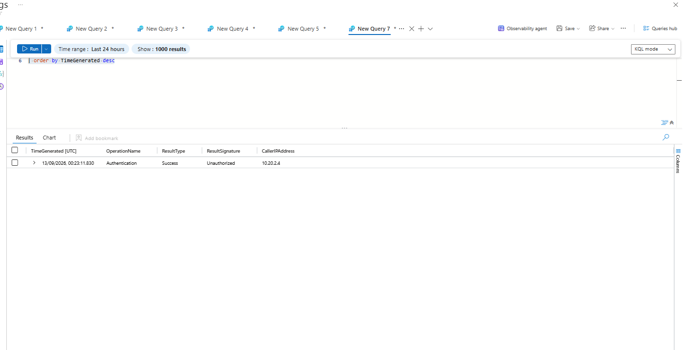
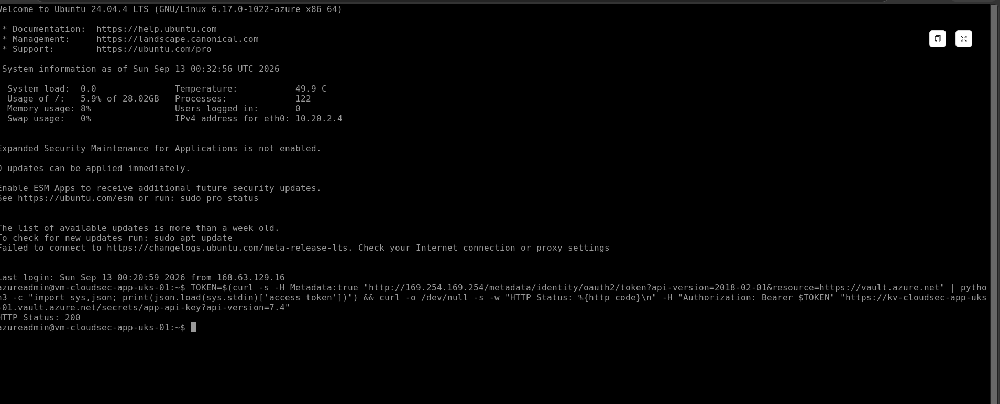

# Module 10 — Attack, Detect, Respond & Final Architecture

## 1. Module Overview

This module served as the final capstone for the Azure Cloud Security Engineering Portfolio.

Rather than introducing another isolated Azure control, the objective was to demonstrate how the security capabilities implemented throughout the portfolio work together during a controlled security scenario.

The capstone followed the security lifecycle:

**Simulate → Detect → Investigate → Contain → Remediate → Validate**

The scenario focused on a controlled unauthenticated attempt to access a secret stored within a privately accessible Azure Key Vault.

The exercise validated:

- Private connectivity
- Key Vault network restrictions
- Authentication enforcement
- Managed Identity
- Diagnostic logging
- Log Analytics
- KQL investigation
- Detection validation
- Containment
- Post-incident service validation
- Overall Azure security architecture

---

## 2. Capstone Security Scenario

The protected resource used for the exercise was:

`kv-cloudsec-app-uks-01`

The application workload was:

`vm-cloudsec-app-uks-01`

The VM operates without a public IP address and accesses the Key Vault through Azure Private Link.

The VM uses a system-assigned Managed Identity for legitimate access to the Key Vault.

The objective was to demonstrate that:

1. The legitimate workload could reach Key Vault privately.
2. An unauthenticated request would be rejected.
3. The unauthorized request would generate security telemetry.
4. The event could be investigated using KQL.
5. Existing security controls would contain the attempt.
6. Legitimate Managed Identity access would remain operational.

---

## 3. Baseline Private Connectivity Validation

Before generating the controlled security event, DNS resolution from the application VM was validated.

The application VM:

`vm-cloudsec-app-uks-01`

had private IP:

`10.20.2.4`

The following lookup was performed:

```bash
nslookup kv-cloudsec-app-uks-01.vault.azure.net
```

The standard Key Vault hostname resolved through:

`kv-cloudsec-app-uks-01.privatelink.vaultcore.azure.net`

to:

`10.20.1.4`

This confirmed that Key Vault connectivity was using the configured Azure Private Endpoint and Private DNS architecture.

The validated path was:

```text
Application VM
10.20.2.4
      |
      v
Azure Virtual Network
      |
      v
Private DNS
privatelink.vaultcore.azure.net
      |
      v
Key Vault Private Endpoint
10.20.1.4
      |
      v
Azure Key Vault
```

---

## 4. Controlled Attack Simulation

A controlled unauthenticated request was sent to the Key Vault secret endpoint.

The request intentionally contained no Azure authentication token.

The Key Vault returned:

`HTTP 401 Unauthorized`

This demonstrated that network connectivity alone was insufficient to retrieve the protected secret.

The request successfully reached the Key Vault through the private network path, but Azure Key Vault authentication controls prevented unauthorized secret access.

No secret value was disclosed during the simulation.

---

## 5. Detection Validation

Key Vault diagnostic telemetry was queried through the Log Analytics workspace:

`law-cloudsec-core-uks-01`

The unauthorized request was successfully identified in the `AzureDiagnostics` table.

The captured telemetry showed:

- **OperationName:** Authentication
- **ResultSignature:** Unauthorized
- **CallerIPAddress:** `10.20.2.4`

The telemetry correlated with the controlled HTTP 401 request generated from the application VM.

This validated the monitoring path:

```text
Controlled Unauthorized Request
              |
              v
        Azure Key Vault
              |
              v
       Diagnostic Logging
              |
              v
    Log Analytics Workspace
              |
              v
       AzureDiagnostics
              |
              v
        KQL Investigation
```

### Detection Evidence



*Detection validation of a controlled unauthenticated Azure Key Vault request. Key Vault audit telemetry captured the request from application VM `10.20.2.4` with `ResultSignature = Unauthorized`, correlating with the HTTP 401 response and demonstrating visibility of failed authentication activity.*

---

## 6. Security Investigation

Following detection of the unauthorized authentication event, Key Vault telemetry surrounding the event was investigated.

The investigation focused on the time window surrounding the controlled request.

KQL was used to review:

- Event timestamp
- Key Vault operation
- Authentication result
- Result signature
- Caller IP address
- Surrounding Key Vault activity

The investigation query used the Key Vault diagnostic telemetry stored within `AzureDiagnostics`.

The purpose of the investigation was to establish context around the event and determine whether additional suspicious Key Vault operations occurred around the controlled authentication attempt.

This demonstrated the transition from simply detecting an event to investigating its surrounding security context.

---

## 7. Containment and Remediation Assessment

The controlled request did not require emergency remediation because the security architecture had already contained the attempted access.

The request was prevented by existing controls.

Relevant controls included:

- Key Vault public network access disabled
- Azure Private Endpoint connectivity
- Private DNS
- Azure RBAC
- Managed Identity authentication
- Key Vault authorization
- Diagnostic logging

The unauthenticated request resulted in:

`HTTP 401 Unauthorized`

Therefore, the protected secret was not retrieved by the unauthenticated request.

The appropriate response was to validate that legitimate application access remained operational rather than unnecessarily modifying working security controls.

---

## 8. Post-Incident Validation

After the unauthorized request was investigated, the application VM's system-assigned Managed Identity was used to access the same Key Vault secret endpoint.

The VM obtained an Azure Managed Identity access token and presented it to Azure Key Vault.

The resulting request returned:

`HTTP Status: 200`

This demonstrated that the legitimate workload remained operational while unauthorized access continued to be rejected.

The result demonstrates an important Zero-Trust principle:

**Network access does not automatically provide application authorization.**

The architecture independently enforced:

- Network access
- Identity authentication
- Resource authorization

### Authorized Access Evidence



*Post-incident validation confirming that the application VM's system-assigned Managed Identity retained legitimate access to Azure Key Vault, returning HTTP 200 while unauthenticated access remained denied.*

---

## 9. Attack-to-Response Lifecycle

The complete capstone demonstrated the following lifecycle:

```text
1. SIMULATE
   |
   | Unauthenticated Key Vault request
   v
2. PREVENT
   |
   | HTTP 401 Unauthorized
   v
3. LOG
   |
   | Key Vault diagnostic telemetry
   v
4. DETECT
   |
   | AzureDiagnostics / KQL
   v
5. INVESTIGATE
   |
   | Review event context and surrounding activity
   v
6. CONTAIN
   |
   | Existing identity and authorization controls
   | prevented secret access
   v
7. VALIDATE
   |
   | Managed Identity authenticated successfully
   | HTTP 200
   v
8. CONFIRM
   |
   | Unauthorized access denied
   | Authorized workload remains operational
```

---

## 10. Final Security Architecture

The completed Azure security architecture uses multiple defensive layers rather than relying on a single security control.

```text
                         Azure Subscription
                                |
                  +-------------+-------------+
                  |                           |
             Governance                    Identity
                  |                           |
        Azure Policy / Locks              Azure RBAC
        Tags / Defender for Cloud        Managed Identity
                  |                           |
                  +-------------+-------------+
                                |
                                v
                      Azure Virtual Network
                          10.20.0.0/16
                                |
              +-----------------+-----------------+
              |                 |                 |
              v                 v                 v
          Web Subnet         App Subnet      Management Subnet
                              |
                              v
                       Application VM
                         10.20.2.4
                       No Public IP
                              |
                     System-Assigned
                      Managed Identity
                              |
                              v
                        Private Link
                              |
                              v
                     Key Vault Private
                         Endpoint
                         10.20.1.4
                              |
                              v
                       Azure Key Vault
                      Public Access OFF
                              |
                              v
                     Diagnostic Settings
                              |
                              v
                    Log Analytics Workspace
                 law-cloudsec-core-uks-01
                              |
                              v
                     Microsoft Sentinel
                              |
                    +---------+---------+
                    |                   |
                    v                   v
                  KQL             Analytics Rules
                    |                   |
                    v                   v
              Investigation       Threat Detection
                    |
                    v
               Threat Hunting
```

---

## 11. Defence-in-Depth Review

The final architecture demonstrates several layers of cloud security.

### Governance

Azure Policy restricts resource deployment according to defined governance requirements.

A custom governance initiative was used to combine security policies.

Resource locks provide protection against accidental deletion.

Defender for Cloud and Secure Score provide cloud security posture visibility.

### Network Security

The environment uses:

- Azure Virtual Network
- Security-zoned subnets
- Network Security Groups
- Controlled routing
- Private IP addressing
- Private Endpoints
- Private DNS

The application VM has no public IP address.

### Identity Security

Access is controlled through:

- Azure RBAC
- Least privilege
- System-assigned Managed Identity

Applications can authenticate to Azure services without storing reusable credentials directly on the VM.

### Data Protection

Azure Storage and Azure Key Vault were configured with private-access controls.

Key Vault public network access is disabled.

Storage Shared Key access was disabled and Managed Identity access was validated.

### Monitoring

Security telemetry is centralized through:

- Azure Activity Log
- Resource diagnostic settings
- Log Analytics
- Microsoft Sentinel

### Detection

KQL was used for:

- Telemetry validation
- Detection engineering
- Investigation
- Threat hunting

A Microsoft Sentinel analytics rule was created for Azure RBAC role-assignment changes.

### Response

The final capstone demonstrated:

- Controlled security-event generation
- Detection
- Investigation
- Containment assessment
- Post-incident validation

---

## 12. Security Control Validation Summary

| Security Control | Validation |
|---|---|
| Azure RBAC | Validated |
| Azure Policy | Validated |
| Resource Lock | Validated |
| Network Segmentation | Validated |
| NSG Controls | Validated |
| Private Endpoints | Validated |
| Private DNS | Validated |
| VM Without Public IP | Validated |
| Bastion Administration | Validated |
| Managed Identity | Validated |
| Key Vault Private Access | Validated |
| Key Vault Authentication Enforcement | Validated |
| Storage Shared Key Disabled | Validated |
| Diagnostic Logging | Validated |
| Log Analytics Ingestion | Validated |
| KQL Investigation | Validated |
| Microsoft Sentinel Analytics Rule | Implemented |
| Threat Hunting | Validated |
| Sentinel Incident Generation | Not validated |
| Sentinel SOAR / Logic App | Not implemented due to documented portal limitation |

The table deliberately distinguishes between controls that were implemented and validated and capabilities that could not be practically validated within the lab environment.

---

## 13. Portfolio Security Lifecycle

Across the portfolio, the environment progressed from basic Azure infrastructure to an integrated cloud security architecture.

```text
Azure Foundation
      |
      v
Network Security
      |
      v
Secure Workloads
      |
      v
Private Access / Zero Trust
      |
      v
Security Posture / Governance
      |
      v
Monitoring / Log Analytics
      |
      v
Microsoft Sentinel
      |
      v
Detection Engineering
      |
      v
Threat Hunting
      |
      v
Attack / Detect / Investigate / Respond
```

Terraform and DevSecOps remain separate roadmap areas where additional implementation work can be completed.

---

## 14. Key Engineering Outcomes

The portfolio demonstrates practical implementation and validation of:

- Azure security architecture
- Cloud governance
- Azure RBAC
- Network segmentation
- NSGs and routing
- Secure Azure workloads
- Managed Identity
- Azure Key Vault
- Azure Storage security
- Private Endpoints
- Private DNS
- Zero-Trust access principles
- Defender for Cloud
- Secure Score assessment
- Azure Policy
- Governance initiatives
- Resource locks
- Azure monitoring
- Diagnostic logging
- Log Analytics
- Microsoft Sentinel
- KQL
- Detection engineering
- MITRE ATT&CK mapping
- Threat hunting
- Controlled attack simulation
- Security investigation
- Containment validation

The project emphasizes practical validation rather than configuration alone.

Where possible, controls were deliberately tested to prove that they enforced the intended security outcome.

---

## 15. Lessons Learned

Key lessons from the capstone include:

1. A private endpoint controls network reachability but does not replace authentication and authorization.

2. Managed Identity allows workloads to authenticate to Azure services without embedding reusable credentials in application configuration.

3. Preventive controls and detective controls should operate together.

4. Diagnostic logging is essential for investigating security events after they occur.

5. KQL provides a common mechanism for telemetry analysis, detection engineering and threat hunting.

6. Security controls should be tested rather than assumed to work because they are configured.

7. Effective containment does not always require disabling a service or identity when existing controls have already prevented the attempted action.

8. Post-incident validation is important to confirm that legitimate workloads remain operational.

9. Environmental limitations should be documented rather than represented as successfully implemented capabilities.

10. Cloud security engineering requires governance, identity, networking, workload protection, monitoring, detection and response controls to operate as an integrated architecture.

---

## 16. Module Status

**COMPLETE**

The Module 10 capstone successfully demonstrated:

- Controlled attack simulation
- Preventive-control enforcement
- Security telemetry generation
- Detection validation
- Security investigation
- Containment assessment
- Authorized-access validation
- Final security architecture review

The controlled unauthenticated Key Vault request was rejected with:

`HTTP 401 Unauthorized`

The event was captured in Key Vault diagnostic telemetry with:

`ResultSignature = Unauthorized`

The legitimate application VM subsequently authenticated using its system-assigned Managed Identity and received:

`HTTP Status: 200`

This demonstrated the final security outcome:

**Unauthorized access was denied and observable, while legitimate identity-based access remained operational.**

---

## Portfolio Status

**Azure Cloud Security Engineering Portfolio — Practical Capstone Complete**

Modules completed:

- Module 1 — Azure Foundation & Secure Architecture
- Module 2 — Azure Networking & Network Security
- Module 3 — Secure Azure Workloads
- Module 4 — Private Access & Zero-Trust Architecture
- Module 5 — Cloud Security Posture & Governance
- Module 8 — Azure Monitoring & Microsoft Sentinel
- Module 9 — Detection Engineering, Threat Hunting & SOAR
- Module 10 — Attack, Detect, Respond & Final Architecture

Remaining roadmap implementation:

- Module 6 — Terraform Infrastructure as Code
- Module 7 — GitHub & DevSecOps CI/CD

The portfolio therefore demonstrates a substantial end-to-end Azure Cloud Security Engineering implementation while clearly identifying the remaining Infrastructure-as-Code and DevSecOps work.
